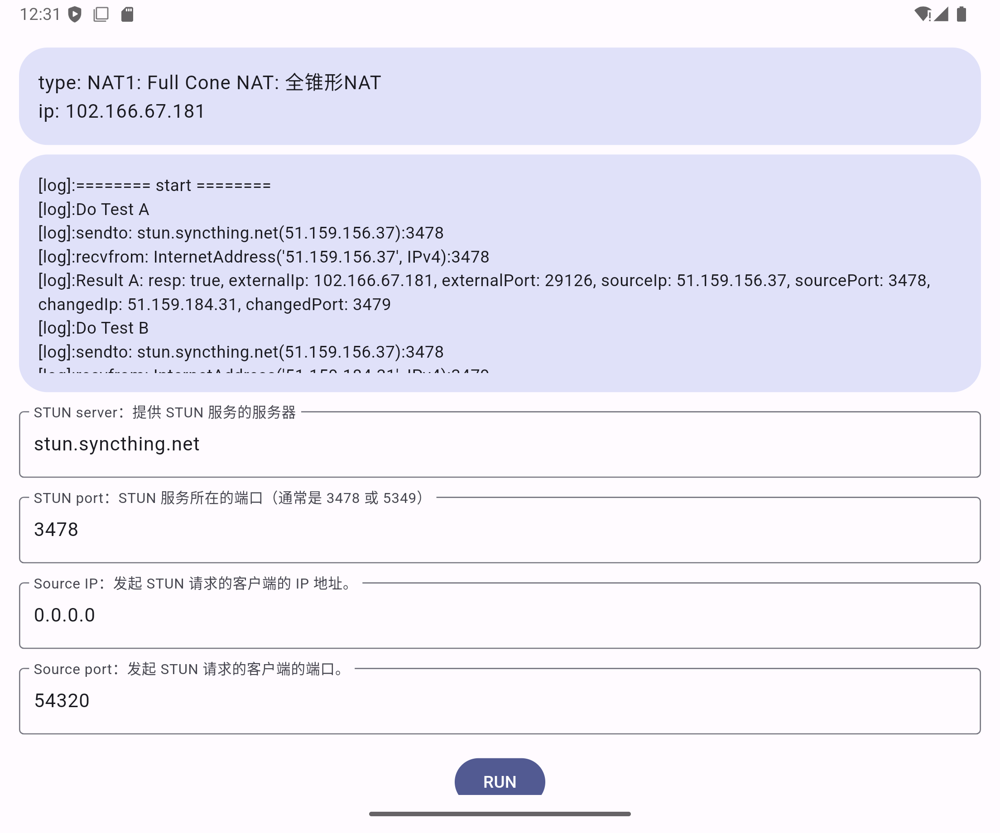

# Purity NAT Type Tester

Purity NAT Type Tester is a cross-platform NAT type checking tool that supports iOS, Android, Windows, macOS, and Linux.

## Features

- **Cross-Platform**: Supports iOS, Android, Windows, macOS, and Linux
- **NAT Type Detection**: Identifies current network NAT types (Full Cone, Restricted Cone, Port Restricted Cone, Symmetric)
- **User-Friendly Interface**: Easy-to-use interface design

## Web Platform Not Supported

This application does not support web platforms due to browser limitations on using UDP over WebSockets. For more information, please refer to the following links:

- [Why can't I send UDP packets from a browser?](https://gafferongames.com/post/why_cant_i_send_udp_packets_from_a_browser/)
- [JavaScript WebSockets with UDP?](https://stackoverflow.com/questions/4657033/javascript-websockets-with-udp)
- [Reading from UDP port in browser](https://www.codeease.net/programming/questions/reading-from-udp-port-in-browser)

## License

This project is licensed under the GPL License.

## Resources

- [家庭网络中的「NAT」到底是什么？](https://sspai.com/post/68037)
- [P2P通信原理与实现](./doc/P2P通信原理与实现.md)
- [P2P通信标准协议(一)之STUN](./doc/P2P通信标准协议(一)之STUN.md)
- [NAT的四种类型以及类型探测](./doc/NAT的四种类型以及类型探测.md)
- [talkiq/pystun3](https://github.com/talkiq/pystun3)
- [HMBSbige/NatTypeTester](https://github.com/HMBSbige/NatTypeTester)
